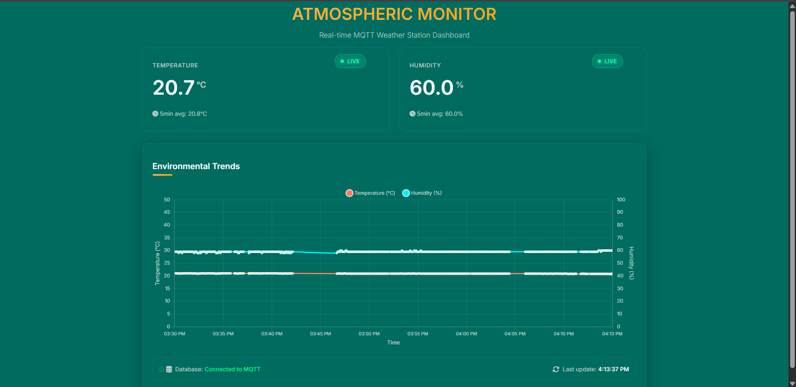

# MQTT Weather Station

This application collects temperature and humidity data from an MQTT broker, stores it in an SQLite database, and visualizes it with real-time updates and 5-minute averages.



## Features

- 🌡️ Real-time temperature and humidity monitoring
- 📊 Interactive charts showing 5-minute averages
- 💾 SQLite database storage for historical data
- 📱 Responsive design for desktop and mobile

## Setup Instructions

### Prerequisites

- Node.js (v14 or later)
- npm (v6 or later)

### Installation

1. Clone the repository:
   ```bash
   git clone https://github.com/yourusername/mqtt-weather-app
   cd mqtt-weather-app
   ```

2. Install dependencies:
   ```bash
   npm install express sqlite3 body-parser
   ```

3. Create a `public` directory and place the `index.html` file inside:
   ```bash
   mkdir -p public
   cp index.html public/
   ```

4. Start the server:
   ```bash
   node server.js
   ```

5. Access the application:
   - Open your browser and navigate to `http://localhost:3000`
   - Note: If you open index.html directly (file://), it will automatically redirect to http://localhost:3000

### Viewing Data

The application provides several ways to view your data:

1. Main Dashboard (`http://localhost:3000`):
   - Real-time temperature and humidity values
   - Interactive chart with historical data
   - 5-minute averages

2. Database Viewers:
   - Raw Data: `http://localhost:3000/db-viewer/raw-data`
   - Averaged Data: `http://localhost:3000/db-viewer/avg-data`

### Important Notes

- The server must be running for the application to work properly
- Historical data is only available when accessing through `http://localhost:3000`
- The database viewers auto-refresh every 30 seconds

## Project Structure

```
mqtt-weather-app
├── public/
│   └── index.html        # Frontend interface with Chart.js visualization
├── server.js            # Express backend with API endpoints and SQLite logic
├── package.json        # Node.js dependencies
├── weather_data.db    # SQLite database (created automatically)
└── README.md         # Setup instructions
```

## How It Works

1. The frontend connects to the MQTT broker and displays real-time temperature and humidity values
2. Each MQTT message is sent to the backend and stored in the SQLite database
3. Every 5 minutes, the backend calculates averages and stores them in a separate table
4. The chart displays up to one hour of historical data (twelve 5-minute intervals)

## API Endpoints

- POST `/api/weather/data` - Store raw temperature and humidity readings
- GET `/api/weather/historical` - Retrieve historical data for charting
- GET `/api/weather/history` - Retrieve averaged historical data

## Database Schema

### Raw Data Table
Stores every reading received from MQTT:
```sql
CREATE TABLE raw_data (
    id INTEGER PRIMARY KEY AUTOINCREMENT,
    type TEXT NOT NULL,
    value REAL NOT NULL,
    timestamp TEXT NOT NULL
);
```

### Averaged Data Table
Stores 5-minute averages:
```sql
CREATE TABLE avg_data (
    id INTEGER PRIMARY KEY AUTOINCREMENT,
    avg_temperature REAL,
    avg_humidity REAL,
    timestamp TEXT NOT NULL
);
```

## Troubleshooting

If you're not seeing historical data:
1. Ensure the server is running (`node server.js`)
2. Access the application through `http://localhost:3000`
3. Check the database viewers to verify data is being stored
4. Check browser console (F12) for any error messages
